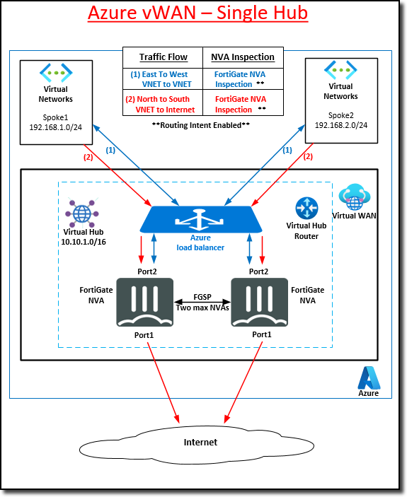

## Course Reference Diagrams

The following reference diagrams will be used throughout this course.

The following two architectures will be deployed:

- **Active/Active FortiGate NVAs in a single existing vWAN hub**

- **Expand the architecture with deployment of a second vWAN hub, a VNET, and routing.  Network traffic between the hubs will be managed through the FortiGate NVAs**

**Continue to Chapter 2 - Azure Virtual WAN Concepts**
