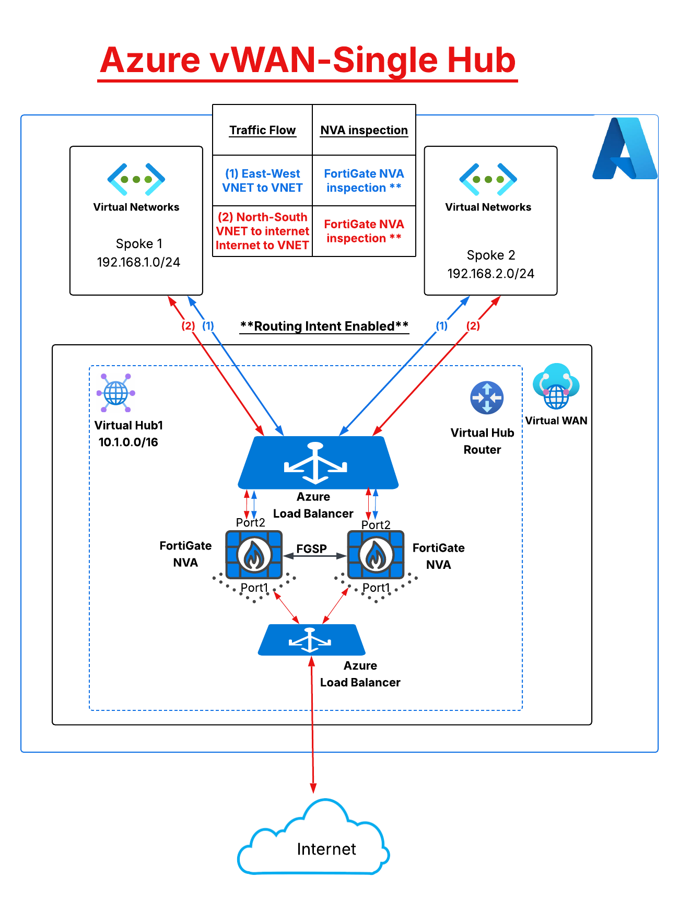

### Azure Virtual WAN

Azure Virtual WAN is a networking service that brings many networking, security, and routing functionalities together to provide a single operational interface. Some of the main features include:

- Branch connectivity (via connectivity automation from Virtual WAN Partner devices such as SD-WAN or VPN CPE).
- Site-to-site VPN connectivity.
- Remote user VPN connectivity (point-to-site).
- Private connectivity (ExpressRoute).
- Intra-cloud connectivity (transitive connectivity for virtual networks).
- VPN ExpressRoute inter-connectivity.
- Routing, Azure Firewall, and encryption for private connectivity.

You don't have to have all of these use cases to start using Virtual WAN. You can get started with just one use case, and then adjust your network as it evolves.

The Virtual WAN architecture is a hub and spoke architecture with scale and performance built in for branches (VPN/SD-WAN devices), users (Azure VPN/OpenVPN/IKEv2 clients), ExpressRoute circuits, and virtual networks. It enables a global transit network architecture, where the cloud hosted network 'hub' enables transitive connectivity between endpoints that might be distributed across different types of 'spokes'.

**Virtual WAN offers the following advantages:**

- Integrated connectivity solutions in hub and spoke: Automate site-to-site configuration and connectivity between on-premises sites and an Azure hub.
- Automated spoke setup and configuration: Connect your virtual networks and workloads to the Azure hub seamlessly.
- Intuitive troubleshooting: You can see the end-to-end flow within Azure, and then use this information to take required actions.

In this course, the vWAN has already been deployed.

**Continue to Chapter 2 - Task 2: Azure vWAN resources**
