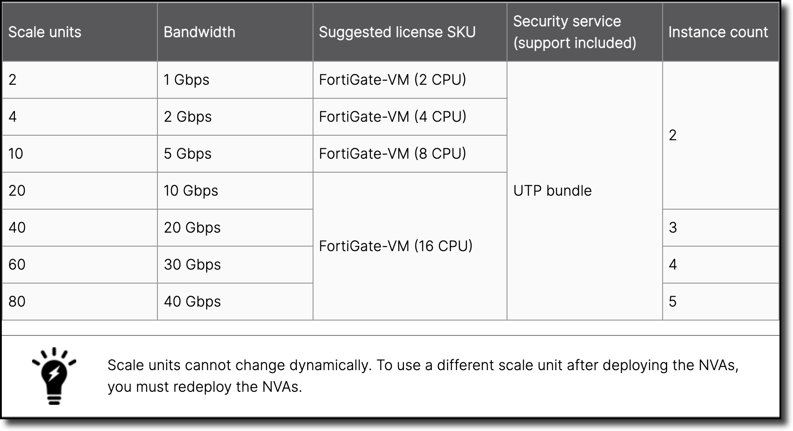
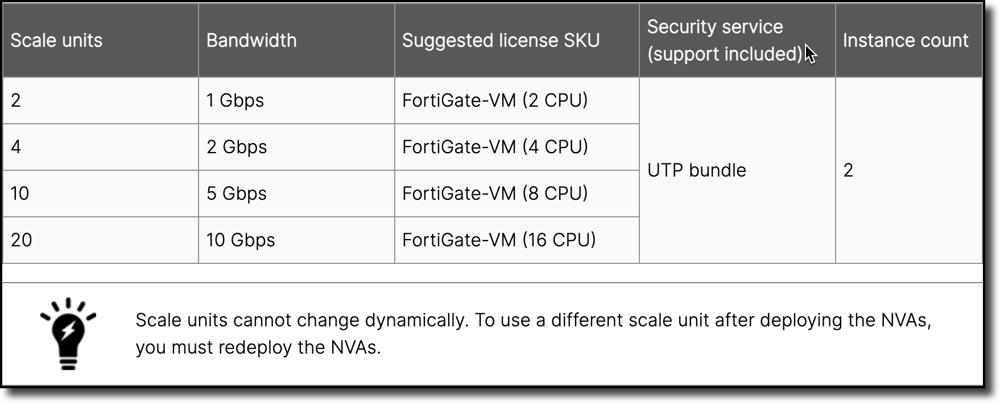

Microsoft Azure supports virtual WAN (vWAN) and partners with third-party solution providers, such as Fortinet, to deploy network virtual appliances (NVAs) to a vWAN hub.

### FortiGate NVA

By combining stateful inspection with a comprehensive suite of powerful security features, FortiGate next generation firewall technology delivers complete content and network protection. This solution is available for deployment in the Microsoft Azure vWAN managed service.

In addition to advanced features such as an extreme threat database, vulnerability management, and flow-based inspection, features including application control, firewall, antivirus, IPS, web filter, and VPN work in concert to identify and mitigate the latest complex security threats.

FortiGate NVAs are deployed in an active/active high availability (HA) configuration with FortiGate-native FGSP synchronization between the NVAs.

### Order Types

Choose one of the following scale unit values when deploying FortiGate NVAs.  Higher scale units are available for increased bandwidth requirements. A specific FortiGate virtual machine license is recommended for each scale unit value.

#### NGFW Deployment

#### SD-WAN NGFW Deployment

{}Azure has release new az cli commands that support changing the scale unit of a NVA with out the need to redeploy the environment. See [NVA Management](https://learn.microsoft.com/en-us/cli/azure/network/virtual-appliance?view=azure-cli-latest){}

### Deployment Requirements

Deployment requires the following:

- The number of required FortiGate licenses depends on the selected scale unit. Bring-Your-Own-License (BYOL), FortiFlex, and Pay-As-You-Go (PAYG) are all supported. the desired licensing method can be chosen during deployment.
- One fully licensed FortiManager instance (BYOL or Flex) is recommended, but not required.

**Continue to Chapter 3 - Getting Started**
