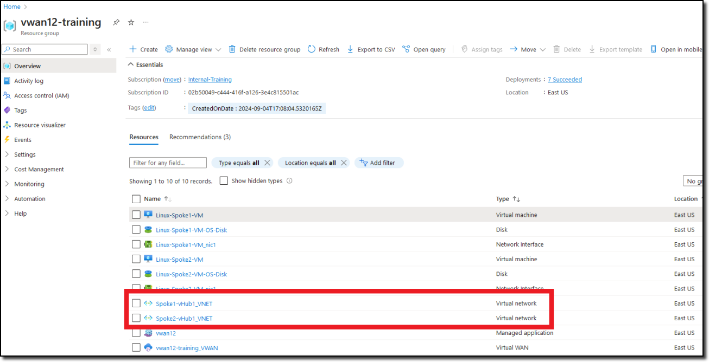
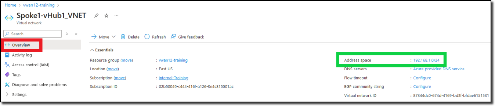
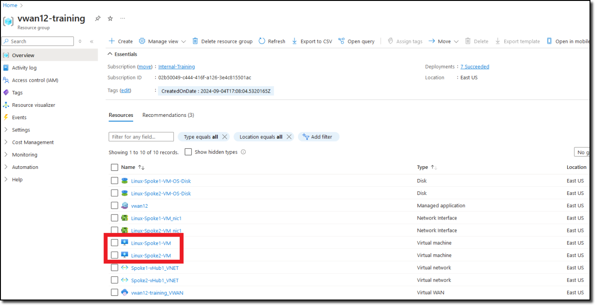
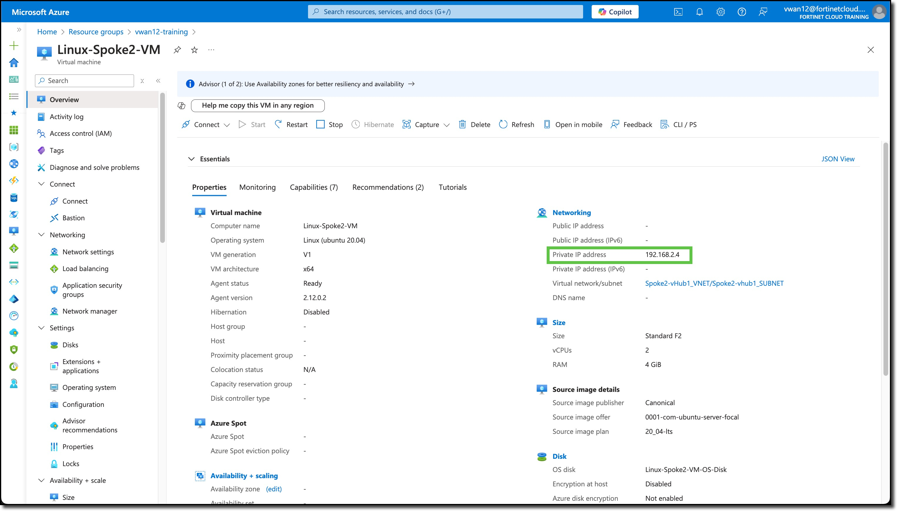
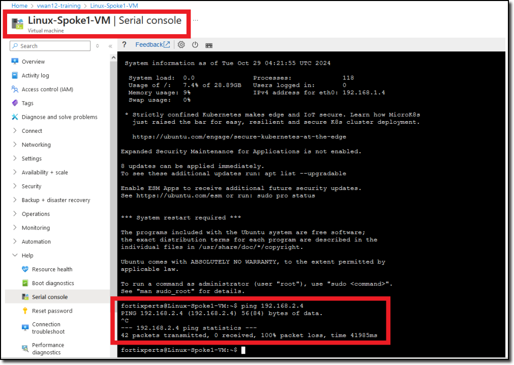

To be part of an Azure Virtual WAN, Azure VNETs need to be peered to the Azure vWAN hub. Prior to VNETs being peered to a vWAN hub, virtual machines in the VNET will route their traffic based on Azure default routing services such as user defined routing (UDR) or routes advertised by an Azure Route Server.

Two spoke VNETs have been deployed in your assigned resource group, each with a Linux virtual machine (VM). The spoke VNETs are just stand-alone VNETs which means the Linux VMs in one spoke cannot communicate with Linux VMs in the other spoke without setting up VNET peering with the hub and configuring routing.

In this task confirm that each Linux VM cannot communicate between VNETs but can communicate to the Internet.

1. ***View*** the assigned VNET address space, navigate from your assigned resource group to each VNET
  
    - **"Spoke1-vHub1_VNET"**
    - **"Spoke2-vHub1_VNET"**.

        

1. VNET assigned address space can be determined by clicking on a VNET and viewing the **"Address space"** value on the right side of the "Overview" pane.

    VNET **Spoke1-vHub1_VNET** is shown below.
    

1. ***Repeat*** the above steps to determine the **"Address space"** for **Spoke2-vHub1_VNET**.

1. ***View*** the private IP addresses of the spoke VNET Linux VMs, navigate from your assigned resource group to each Linux VM - **"Linux-Spoke1-VM"** and **"Linux-Spoke2-VM"**.

    

    Linux-Spoke1-VM        | Linux-Spoke2-VM
    :-------------------------:|:-------------------------:
     |  

1. Access the serial console on the Linux-Spoke1-VM.

    - Scroll to the bottom of the left-hand navigation on the ***Linux-Spoke1-VM*** resource page
    - Expand the **"Help"** section (if not already expanded)
    - Click **"Serial console"**.  A serial console session will start in the right-hand pane.

1. ***Login*** to Linux-Spoke1-VM:

    - username `fortixperts`
    - password `fortiXperts!`

1. ***Ping*** Linux-Spoke2-VM:

    - `ping 192.168.2.4`

        

1. ***Ping*** **Linux-Spoke1-VM** from **Linux-Spoke2-VM**:

    - Repeat previous steps to access the serial console of ***Linux-Spoke2-VM***

1. ***Ping*** Linux-Spoke1-VM:

    - `ping 192.168.2.4`

1. ***wget*** the Fortinet home page both Linux VMs:

    - `wget https://www.fortinet.com`

    **Both ping tests will fail, these resources are unable to access each other however resources on the Internet are reachable.**

**Continue to Chapter 4 - Task 4: BGP & Routing Intent**
