In this task create FortiGate firewall policies and DNAT (Destination Network Address Translation) policies on the Load balancer to allow Internet inbound network traffic.

1. ***Find*** Internet Inbound IP Address

    1. From your assigned Resource Group **"vwanxx-training"**, navigate to your vWAN **"vwanxx-training_VWAN"** and then your hub **"vwanXX-eastus-vHub1_VHUB"**

    1. ***Click*** Network Virtual Appliance in the left-hand navigation
    1. ***Click*** on "Manage Configurations" in the right-hand "Network Virtual Appliances" pane
    1. ***Click*** on Internet Inbound in the left-hand navigation
    1. ***Note*** You should see a Public IP with "vwanxx-slb-pip" assigned to the load balancer. Notice there are 0 rules assigned to the Loadbalancer
        Load Balancer Rules are required to allow traffic inbound. Each rule specifies IP, Port, and Protocol
    1. ***Copy*** the Name (vwanxx-slb-pip) and IP address to a notepad

    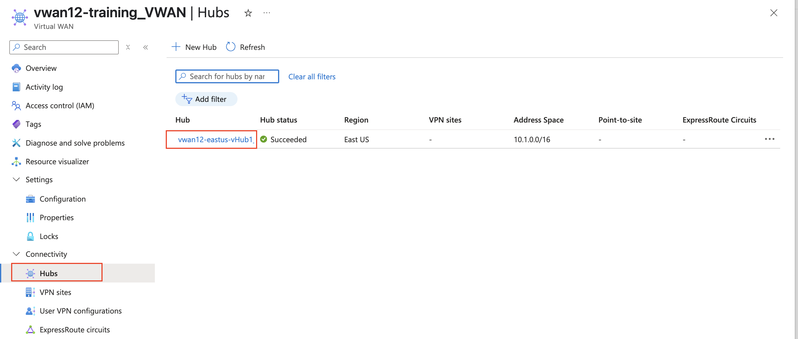

    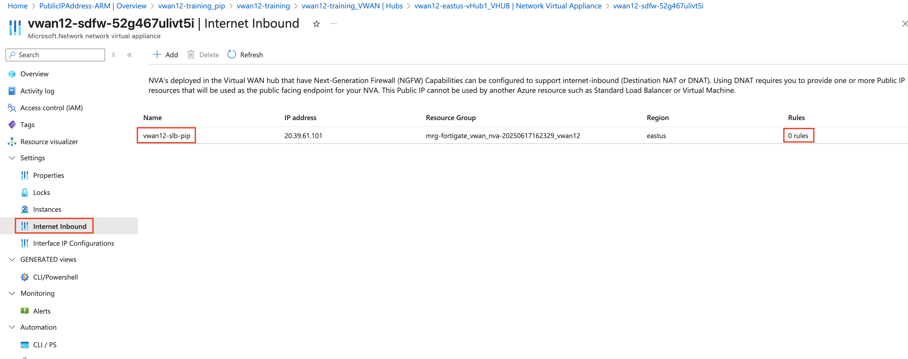

1. To access the CLI on your FortiGate NVAs, following these steps:

    1. From your assigned Resource Group **"vwanxx-training"**, navigate to your vWAN **"vwanxx-training_VWAN"** and then your hub **"vwanXX-eastus-vHub1_VHUB"**
    1. ***Click*** Network Virtual Appliance in the left-hand navigation
    1. ***Click*** "Click here" link under "Instances info" in the right-hand "Network Virtual Appliances" pane
    1. ***Note*** FortiGate Public IP and Private IP addresses
    1. ***Open*** a browser tab to each FortiGate using the Public IP address of each FortiGate

        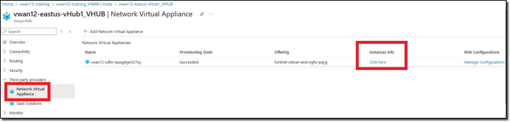
        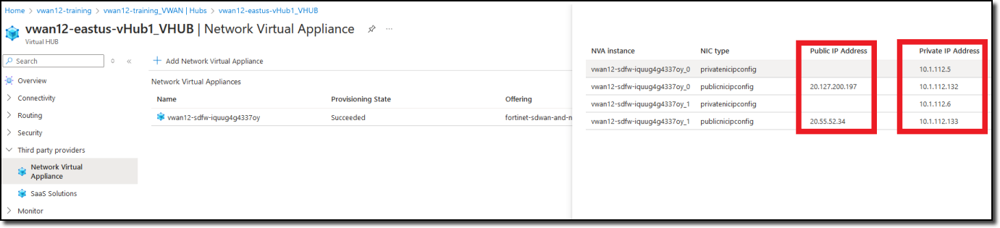

1. ***Login*** to the Fortigate with ***_0*** suffix by using the Public IP address with the provided credentials. Example: **vwanxx-sdfw-52g467ulivt5i_0**

    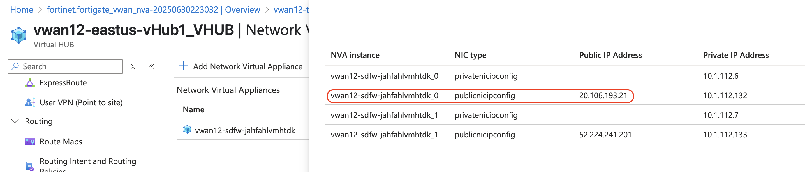

1. ***Click*** on the ***>_*** at the top right corner.

    - ***Copy*** this command `exec azure vwan-slb show`
    - ***Note*** Should see output like below

    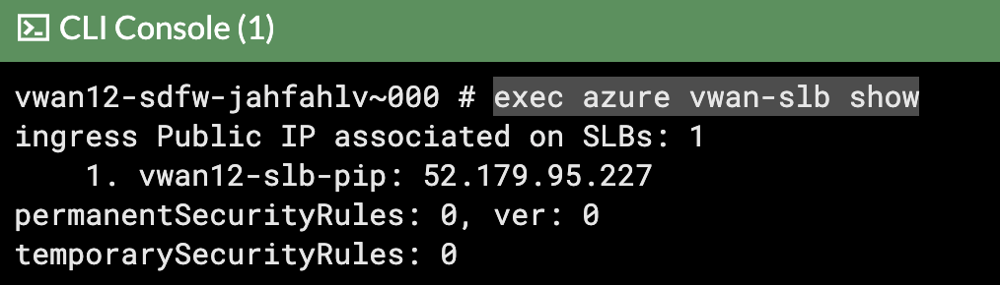

1. ***Copy*** the below configuration to create rules on the loadbalancer. 

    {}Load Balancer rules only need to be configured on **one** FortiGate NVA.{}

    {}Make sure to change the ***applies-on*** to reflect the name of your Public IP </br>
        Copy these CLI commands to notepad or similar tool to update the **vwanxx-slb-pip**, if required.{}

    ```basic
    config azure vwan-slb
        set mode active
        config permanent-security-rules
            config rules
                edit "1"
                    set source-address-prefix "0.0.0.0/0"
                    set destination-port-ranges "8080"
                    set applies-on "vwanxx-slb-pip"
                next
            end
        end
    end
    ```

    {}You should see ***Azure SLB security rules changed*** message once the above configuration is complete.{}

1. ***Check*** to see if the rules are now pushed to the Azure portal, following these steps:

    1. From your assigned Resource Group **"vwanxx-training"**, navigate to your vWAN **"vwanxx-training_VWAN"** and then your hub **"vwanXX-eastus-vHub1_VHUB"**
    1. ***Click*** Network Virtual Appliance in the left-hand navigation
    1. ***Click*** "Manage Configurations" right-hand "Network Virtual Appliances" pane
    1. ***Click*** Internet Inbound.
    1. ***Click*** Rules to show the rules associated with Public IP address.

    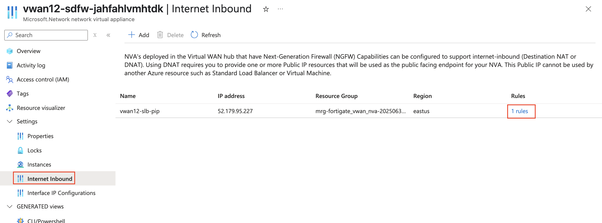

    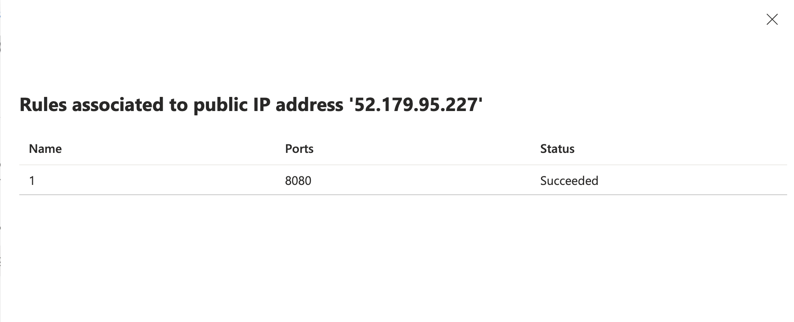

1. ***Login*** to both the NVA FortiGate's again to create a VIP to the web Server **on both** FortiGates.

    1. ***Navigate*** to Policy & objects > Virtual IP's
    1. ***Create*** a new VIP with the following.

        Attribute | Value
        -|-
        Name | `VIP_LinuxVM01`
        Interface | **any**
        External IP address/range | **Use IP address of Loadbalancer named vwanxx-slb-pip**
        Map to IPv4 address/range | **192.168.1.4**
        Port forwarding | **enabled**
        Protocol | **TCP**
        Port Mapping Type| **one to one**
        External service port | **8080**
        Map to IPv4 port | **80**

    1. ***Click*** "OK"

    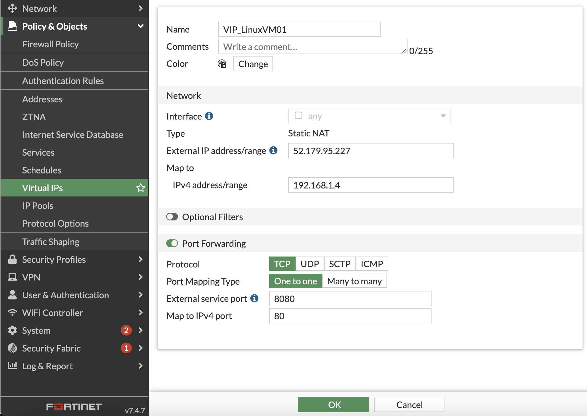

1. ***Create*** Firewall policies **on both** FortiGates to allow traffic to pass from port2 to port1 (Spoke to Internet)

    The FortiGates can be setup to sync configuration information. If one of the FortiGates was designated as the primary configuration supplier and the other as a secondary, any changes made to the primary would be replicated to the secondary.

    Configuration Synchronization was not enabled on the FortiGates as part of this course.

    - ***Navigate*** to "Policy & Objects"
    - ***Click*** Firewall Policy
    - ***Click*** Create new

        Attribute | Value
        -|-
        Name | `port1_to_port2`
        Incoming interface | **port1**
        Outgoing interface | **port2**
        Source | **all**
        Destination | **VIP_LinuxVM01**
        Schedule | **always**
        Service | **ALL**
        NAT | **disabled**
        Enable this policy | **enabled**

    - ***Click*** "OK"

    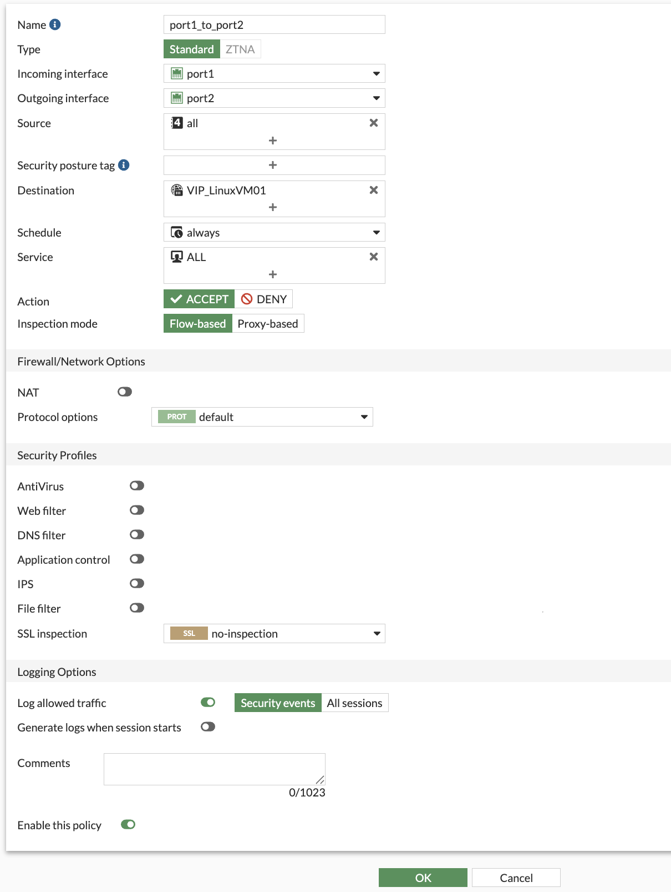

1. ***Navigate*** to a web browser and check if able to reach the web server with vwanxx-slb-pip IP that was used in creating the VIP and port 8080

- http://***vwanxx-slb-pip***:8080

    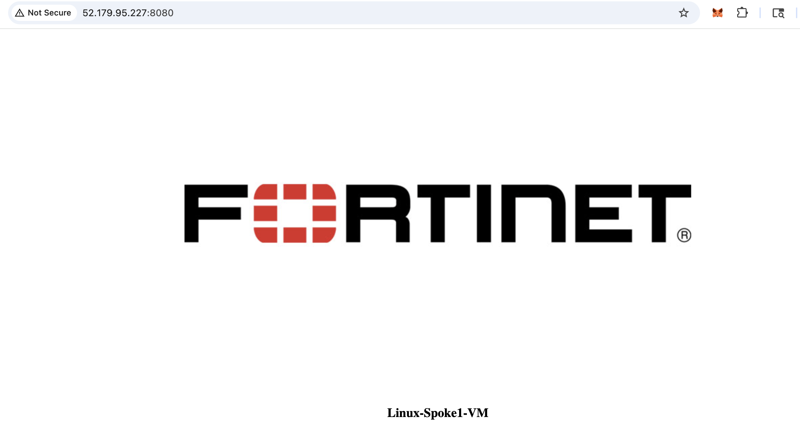


**Continue to Chapter 6 - Two vWAN Hubs**

