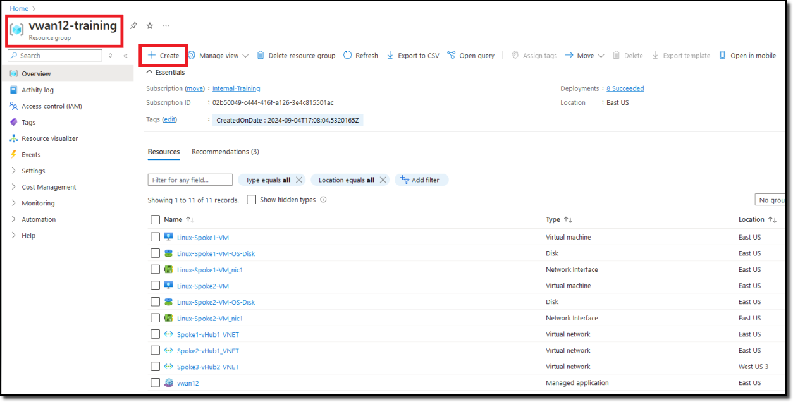
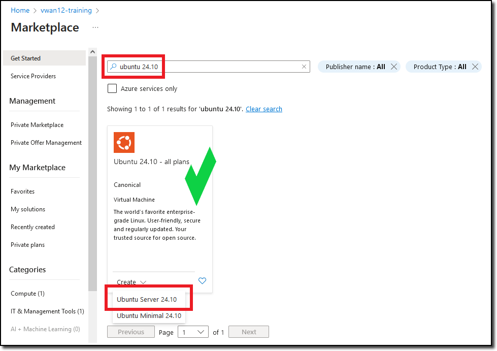
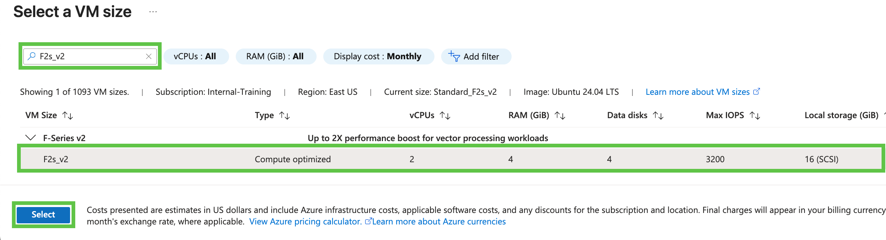
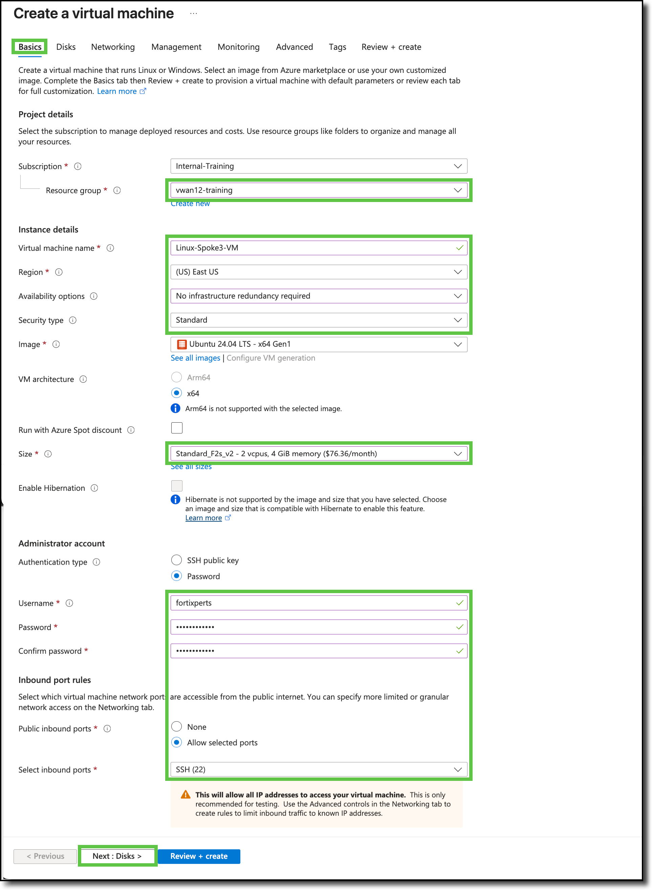
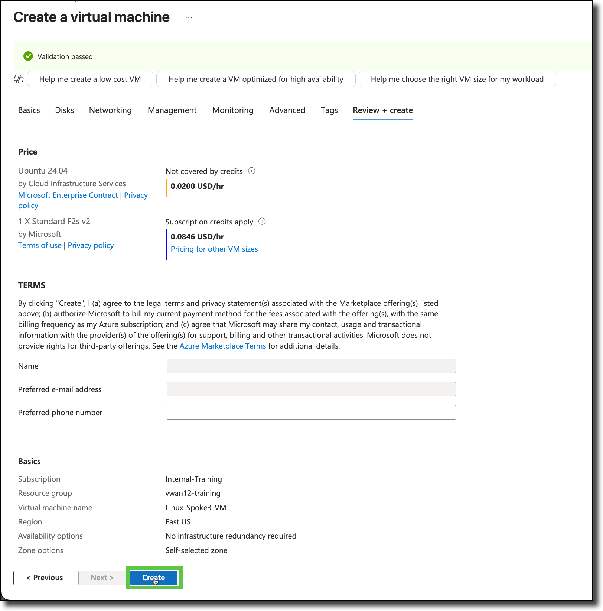
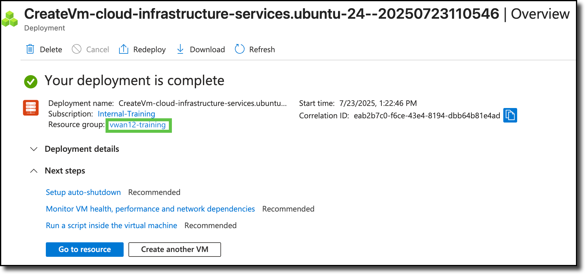

## Deploy a Linux VM

Now that you have the Spoke3-vHub2_VNET deployed, you are going to deploy a Linux VM in Spoke3-vHub2_VNET. This VM will be used to test hub to hub connectivity between spokes peered to different hubs.

### Steps to create a Linux VM

1. ***Navigate*** into your assigned Resource Group and click on the **+ Create** located at the top left of the tool bar.

      

    You will be redirected to the Azure Marketplace.

1. ***Enter***  - **ubuntu 24.10** - in the Marketplace search bar, then press enter.  Navigate to the **Ubuntu 24.10 - all plans** offering from **Canonical** and select **Create** and **Ubuntu Server 24.10**.

    

    You will be redirected to the **Create a virtual machine** template.

1. ***Under*** the **Basics** tab, update the following fields:

    (Leave the default entry for the other fields not listed here)
    - **Resource group**:  Confirm "**vwanXX-training**"
    - **Virtual machine name**:  "**Linux-Spoke3-VM**"
    - **Region**: "**(US) West US**"
    - **Availability options**:  "**No infrastructure redundancy required**"
    - **Security type**:  "**Standard**"
    - **Authentication type**:  "**Password**"
    - **Username**:  "**fortixperts**"
    - **Password**:  "**fortiXperts!**"
    - **Confirm password**:  "**fortiXperts!**"

1. ***Confirm*** the changes and the other fields default entries match the following diagram.

    
    
    

1. ***Click*** **Next: Disks >** - no changes are needed

1. ***Click*** **Next: Networking >**

    Feel free to read through the available disk services that can be changed/enabled.

1. ***Update*** the following fields on the **Networking** tab: (Leave the default entry of the other fields not listed here)

    - **Virtual network**:  "**Spoke3-vHub2_VNET**"
    - **Subnet**:  "**Subnet1-Spoke3_SUBNET (192.168.3.0/24)**"
    - **Public IP**:  Select **None**
    - **NIC network security group**:  Select **None**

1. ***Confirm*** the changes and the other fields default entries match the following diagram

    
    

1. ***Click*** **Review + create >**

    Feel free to read through the **Management**, **Monitoring**, **Advanced**, and **Tags** tabs for additional services that can be changed/enabled.

1. ***Confirm*** the template validation has passed

1. ***Click*** **Create**

    

    {}The **Deployment is in progress** notice is displayed and then the **Your deployment is complete** notice is displayed. {}

    

1. ***Click*** on the **vwanXX-training** link to be re-directed to your resource group.

1. ***Verify*** the new **Linux-Spoke3-VM** and the associated components are listed in your Resource Group.

**Continue to Chapter 6 - Task 4: VNET Peering to the Second Hub**
