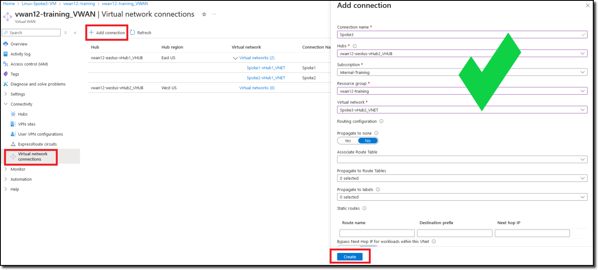
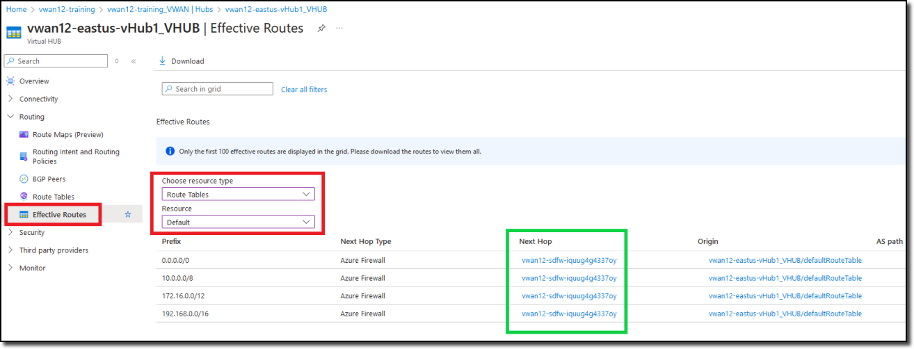
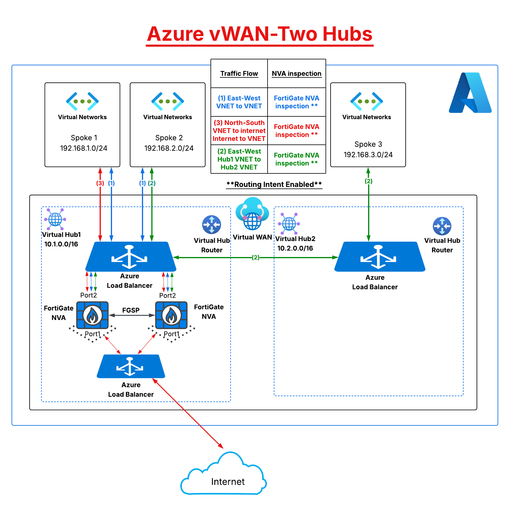

In this task, the student will setup peering between the Spoke3-vHub2_VNET and the  vwanxx-westus-vHub2_VHUB.  Then you will view route tables on the FortiGate NVAs, hubs, and the Linux-Spoke3-VM.

1. Peer Spoke3-vHub2_VNET to vwan12-westus-vHub2_VHUB

    - ***Navigate*** to your Virtual Wan - **vwanXX-training_VWAN**
    - ***Click*** "Virtual network connections" on the left under "Connectivity".
    - ***Click*** "+ Add connection"

    - ***Enter*** - "Connection name" - `Spoke3`
    - ***Select*** - "Hubs" - your second hub -**vwanXX-westus-vHub2_VHUB**
    - ***Select*** - "Resource group" - your resource group - **vwanXX-training**
    - ***Select*** - "Virtual Network" - Spoke3 VNET - **Spoke3-vHub2_VNET**
    - ***Click*** - "Create"

        

        {}VNET Peering takes a few minutes to complete. The Connectivity Status can be updated by ***Clicking*** Refresh{}

        

### Verify Route Tables

Now that the ***Spoke3-vHub2_VNET*** has been peered to your second hub ***vwanXX-westus-vHub2_VHUB*** and both hubs are part of the Azure vWAN, lets take a closer look at the learned routes in each resource.

- What routes do the FortiGates know about?
- What are the effective routes of both hubs?
- What are the effective routes of the Linux-Spoke3-VM?

1. ***View*** each FortiGate's route table

    - ***Open*** each FortiGate in a browser tab/window
    - ***Open*** FortiGate CLI
    - ***Run*** CLI command `get router info routing-table all`

        

    The output shows that BGP learned routes for the new Spoke3-vHub2_VNET peered to the new vwanXX-westus-vHub2_VHUB.

2. ***View*** the effective routes of the default route table, in **both hubs**.

    ***vHub1***
    - ***Navigate*** to your vWAN hub - **vwanXX-eastus-vHub1_VHUB**
    - On the left side, expand "Routing" and then "Effective Routes"
    - ***Select*** - "Route Tables" under "Choose resource type"
    - ***Select*** - "Default" under "Resource"
  
        ***All effective routes should have the FortiGate NVA group as next hop.***
        ***Note that nothing has changed in your vwanXX-eastus-vHub1_VHUB route table.***

        

    ***vHub2***
    - ***Navigate*** to your vWAN hub - **vwanXX-westus-vHub2_VHUB**
    - On the left side, expand "Routing" and then "Effective Routes"
    - ***Select*** - "Route Tables" under "Choose resource type"
    - ***Select*** - "Default" under "Resource"
  
        ***Note the three spoke VNETs learned by vHub2.***

        

3. ***View*** the effective routes on the "Linux-Spoke3-VM"

    - ***Navigate*** to your Linux VM **Linux-Spoke3-VM**
    - ***Click*** - "Network settings" located under "Networking" on the left side of the page
    - ***Click*** - "Linux-Spoke3-VM_nic1 (primary) / ipconfig (primary)
    - One the next page, navigate to ***Help*** on the bottom left and ***Click*** - "Effective Routes"

    Effective routes for ***Linux-Spoke3-VM***
    

    **The effective route's next hop IP is the IP address of internal load balancer that is deployed in vHub2.**

---
The diagram below is a visual representation of what you have deployed and configured.  ***Congrats!***

**Continue to Chapter 6 - Task 5: Manage Network Traffic Between Hubs**
