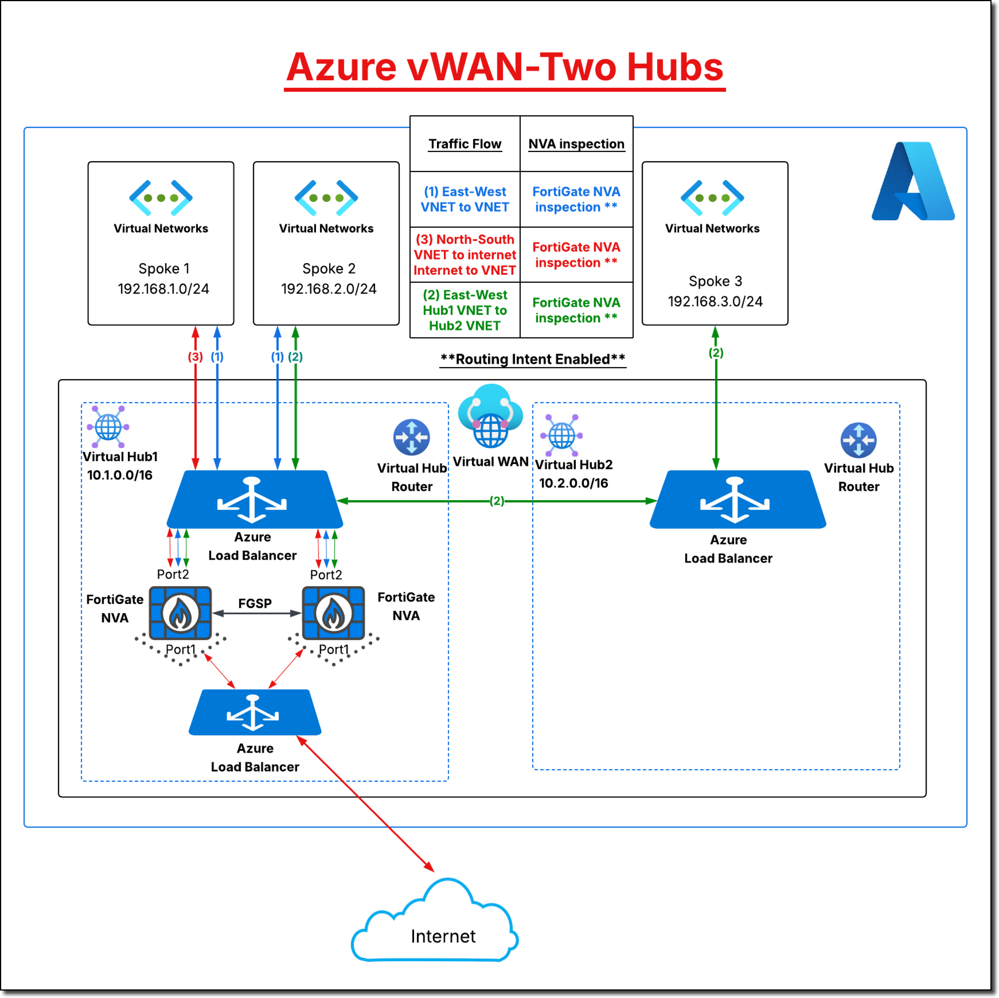

In chapter six deploy a second vWAN hub and create a VNET, peer the VNET to the new hub, deploy a Linux VM, and managed network connectivity between the two hubs.

## Overview

- Deploy a second vWAN hub in another Azure region
- Create an Azure VNET
- Deploy a Linux VM
- Peer the new VNET to the second vWAN hub and verify route tables
- Manage network traffic between the two hubs

After you have completed the above tasks, the diagram below is a visual representation of what you will have deployed and configured.

**Continue to Chapter 6 - Task 1: Deploy a second VWAN Hub**
