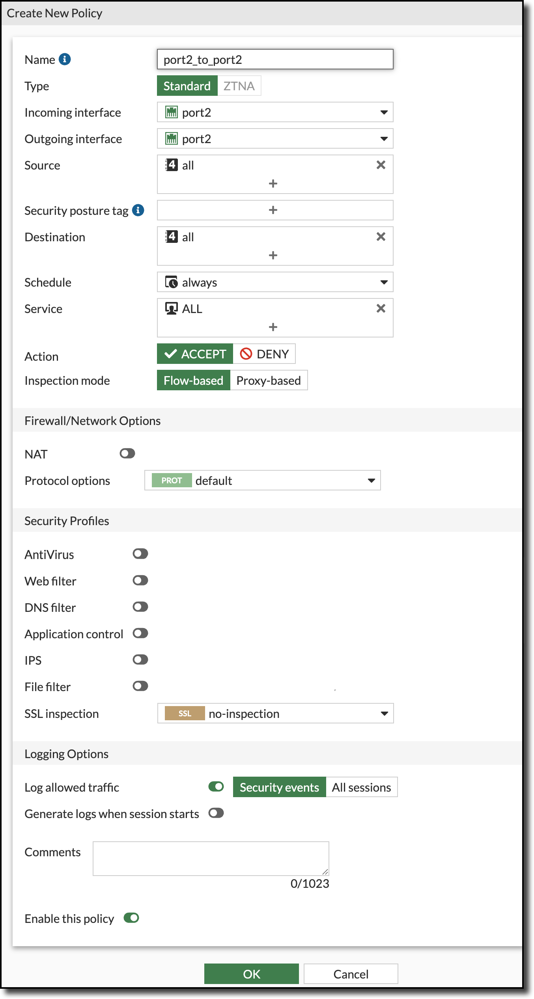

## EAST WEST Inspection

At this point

- Azure Virtual WAN Routing Intent and Route Tables are configured
- Azure Virtual Networks (the Spokes) are connected to the VWAN
- FortiGate BGP is configured and has learned the Spoke networks

Can traffic pass from one spoke to another? Ping is commonly used to test connectivity between devices.

### Spoke to Spoke traffic

1. ***Ping*** between Linux Spoke VMs.

    - ***Open*** a serial console connections to each Linux Spoke VM and ping the other Spoke VM
        - Linux-Spoke1-VM - `ping 172.16.1.4`
        - Linux-Spoke2-VM - `ping 192.168.1.4`

    Neither ping will be successful because the FortiGate is not allowing traffic from port2 to port2, even though port2 would be considered *trusted* since the traffic is all internal. This is the FortiGate's ability to micro-segment the traffic.

    The traffic from each VM **does reach the FortiGate**, but it is dropped. Firewall Policies are required to allow traffic to pass from port2 to port2.

1. Create Firewall policies  on both FortiGates to allow traffic to pass from port2 to port2 (Spoke to Spoke)

    

1. Now try SSH or Ping between Linux VMs.

    
