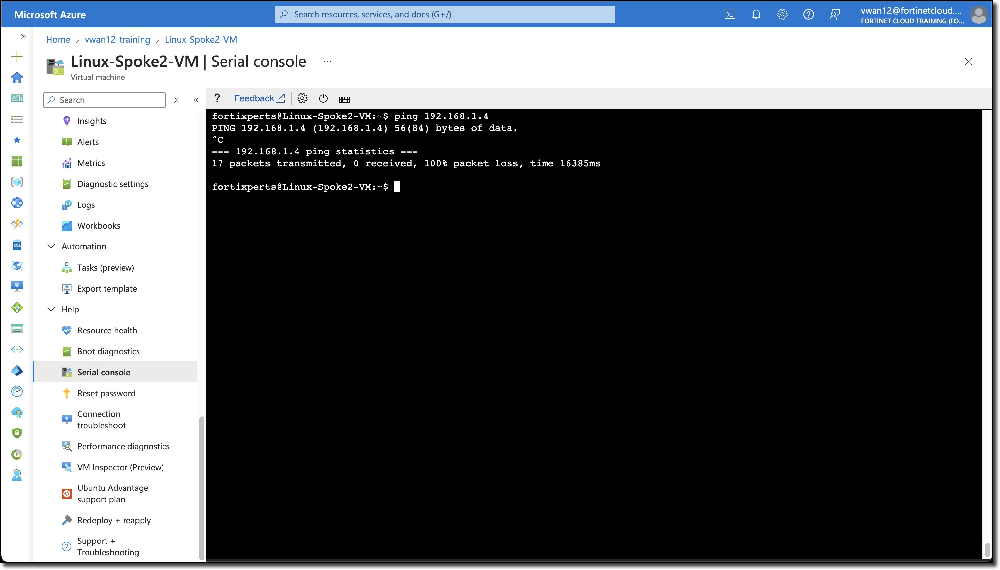
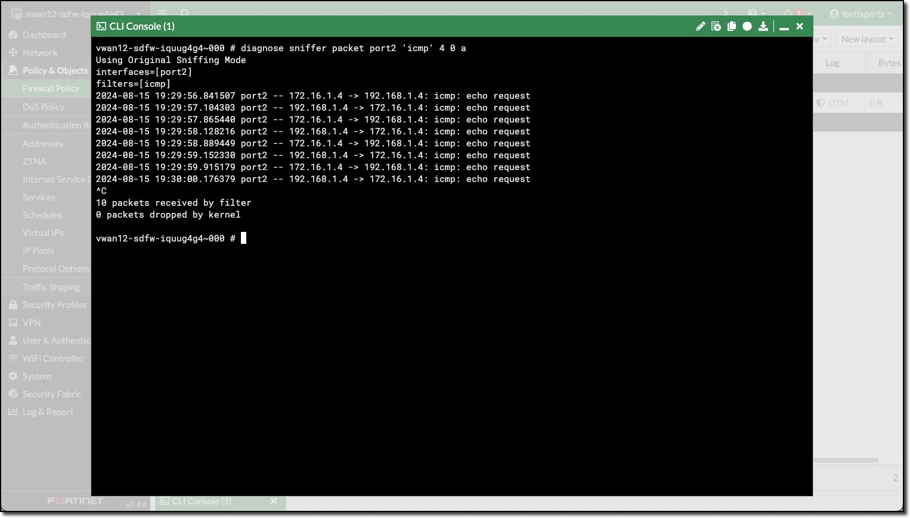
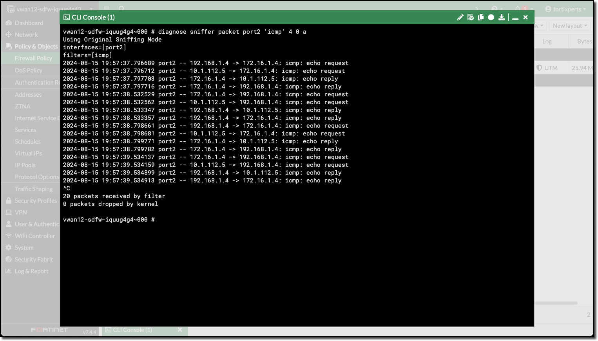
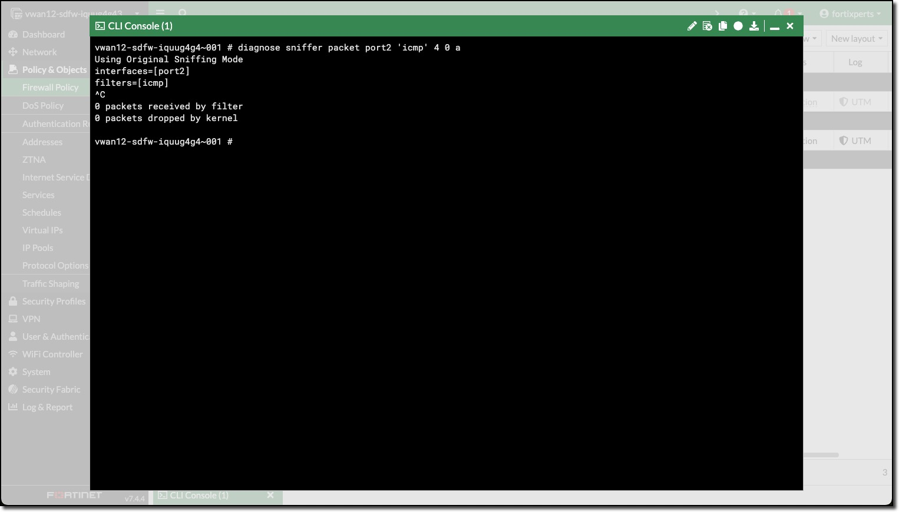

## EAST WEST Inspection

At this point

- Azure Virtual WAN Routing Intent and Route Tables are configured
- Azure Virtual Networks (the Spokes) are connected to the VWAN
- FortiGate BGP is configured and has learned the Spoke networks

Can traffic pass from one spoke to another? Ping is commonly used to test connectivity between devices.

### Spoke to Spoke traffic

1. ***Ping*** between Linux Spoke VMs.

    - ***Open*** a serial console connections to each Linux Spoke VM and ping the other Spoke VM
        - Linux-Spoke1-VM - `ping 172.16.1.4`
        - Linux-Spoke2-VM - `ping 192.168.1.4`

    Neither ping will be successful because the FortiGate is not allowing traffic from port2 to port2, even though port2 would be considered *trusted* since the traffic is all internal. This is the FortiGate's ability to micro-segment the traffic.

    However, the traffic from each VM **does reach the FortiGate**, but it is dropped. Firewall Policies are required to allow traffic to pass from port2 to port2.

1. ***View*** ping traffic from Spoke VMs reaching the FortiGates

    - ***Open*** each FortiGate in a browser tab/window
    - ***Open*** FortiGate CLI
    - ***Run*** CLI command `diagnose sniffer packet port2 'icmp' 4 0 a`
      - **4** - means: print header of packets with interface name
      - **0** - means: continuous output
      - **a** - means: absolute UTC time, yyyy-mm-dd hh:mm:ss.ms

    Linux-Spoke1_VM | Linux-Spoke2_VM
    :-:|:-:
     | 

    FortiGate 0 | FortiGate 1
    :-:|:-:
     | 

    The ping traffic is only on one FortiGate, this is because the internal load balancer sends traffic from the Spokes to one of the FortiGates for inspection.

1. ***Create*** Firewall policies **on both** FortiGates to allow traffic to pass from port2 to port2 (Spoke to Spoke)

    The FortiGates can be setup to sync configuration information. If one of the FortiGates was designated as the Primary configuration supplier and the other as a Secondary, any changes made to the Primary would be replicated to the secondary.

    Configuration Synchronization was not enabled on the FortiGates as part of this session.

    - ***Navigate*** to "Policy & Objects"
    - ***Click*** Firewall Policy
    - ***Click*** Create new
        Attribute | Value
        -|-
        Name | **port2_to_port2**
        Incoming interface | **port2**
        Outgoing interface | **port2**
        Source | **all**
        Destination | **all**
        Schedule | **always**
        Service | **ALL**
        NAT | **enabled**
        IP pool configuration | **Use Outgoing Interface Address**
        Enable this policy | **enabled**
    - ***Click*** "OK"

    

    Linux-Spoke1_VM | Linux-Spoke2_VM
    :-:|:-:
     | 

    FortiGate 0 | FortiGate 1
    :-:|:-:
     | 

Continue to ***Task 2***
