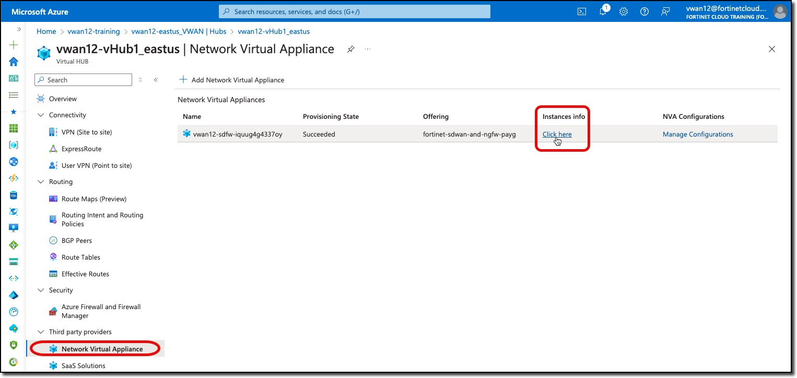
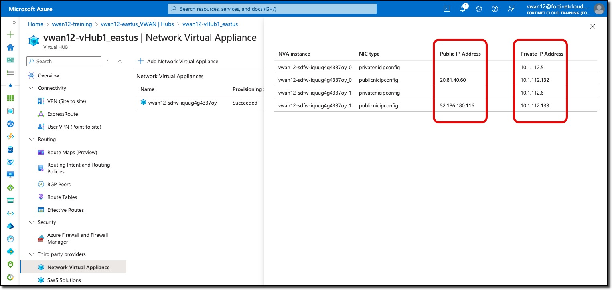

## FGSP Setup

After FortiGate deployment is completed the next step is to configure **FortiGate Session Life Support** [FGSP](https://docs.fortinet.com/document/fortigate/7.4.4/administration-guide/869218/fgsp-basic-peer-setup) on both FortiGates to enable session sync to support the  Active-Active architecture.

{}You will open a browser session to each FortiGate, the FortiGate GUI defaults to a 5 minute "Idle timeout". Avoid continually logging in by setting the idle timeout to 60 minutes in **System--> Settings:Administration Settings:Idle timeout**{}

1. ***Access*** FortiGate CLIs.

    - ***Navigate*** to your Hub **vwanXX-eastus_VWAN**
    - ***Click*** Network Virtual Appliance in the left-hand navigation
    - ***Click*** "Click here" link under "Instances info" in the right-hand "Network Virtual Appliances" pane
    - ***Note*** FortiGate Public IP and Private IP addresses
    - ***Open*** a browser tab to each FortiGate using the Public IP address of each FortiGate

        
        

1. ***Configure*** FGSP

    1. ***Open*** a CLI session on each FortiGate
    1. Enter the blocks of CLI commands on each FortiGate.

    1. On FortiGate ending with **_0** configure the peerip address with the port2 private IP address of the FortiGate ending with **_1**.

        {}If the IP address of **port2** on FortiGate ending**_1** is not **10.1.112.6** replace the **peerip** below with the port2 private IP address of the FortiGate ending with **_1**</br>
        Copy these CLI commands to notepad or similar tool to update the *peerip* address, if required.{}

        ```basic
        config system standalone-cluster
            config cluster-peer
                edit 1
                    set peerip 10.1.112.6
                next
            end
            set standalone-group-id 1
            set group-member-id 1
        end
        ```

    1. ***Answer*** "**y**" to the "Do you want to continue? (y/n)" prompt

        **Changing standalone-group-id or group-member-id will potentially affect FGSP traffic.**</br>
        **Please first make sure the member is isolated from FGSP cluster properly.**</br>
        **Do you want to continue? (y/n)**</br>

        ```basic
        config system ha
            set session-pickup enable
            set session-pickup-nat enable
            set session-pickup-connectionless enable
            set override disable
        end
        ```

    1. On FortiGate ending with **_1** configure the peerip address with the port2 private IP address of the FortiGate ending with **_1**.

        {}If the IP address of **port2** on FortiGate ending**_0** is not **10.1.112.5** replace the **peerip** below with the port2 private IP address of the FortiGate ending with **_0**</br>
        Copy these CLI commands to notepad or similar tool to update the *peerip* address, if required.{}

        {}Notice that the **group-member-id** is **2** in the CLI commands below{}

        ```basic
        config system standalone-cluster
            config cluster-peer
                edit 1
                    set peerip 10.1.112.5
                next
            end
            set standalone-group-id 1
            set group-member-id 2
        end
        ```

    1. ***Answer*** "**y**" to the "Do you want to continue? (y/n)" prompt

        **Changing standalone-group-id or group-member-id will potentially affect FGSP traffic.**</br>
        **Please first make sure the member is isolated from FGSP cluster properly.**</br>
        **Do you want to continue? (y/n)**</br>

        ```basic
        config system ha
            set session-pickup enable
            set session-pickup-nat enable
            set session-pickup-connectionless enable
            set override disable
        end
        ```

**FGSP is now configured and the FortiGates will share session information.**

Continue to ***Next Task***
